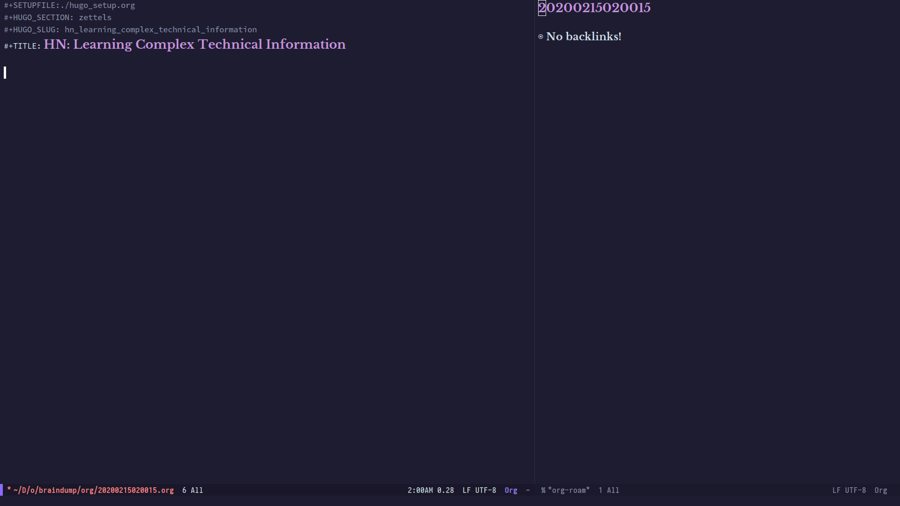

Org-roam was built to support a workflow that was not possible with
vanilla Org-mode. This flow is modelled after the [Zettelkasten
method][zettelkasten], and many of [Roam Research][roam]'s workflows.
Understanding this flow is crucial! Org-roam doesn't auto-magically
make your note-taking better -- it's changing the note-taking workflow
that does.

To understand more the methods and madness, the [Note-Taking
Workflow][appendix:ntw] page contains a page of useful references.
I've also written [a post][jethro-blog-post] about how I use Org-roam.

Without further ado, let's begin!

## Building the Cache

The cache is a sqlite database named `org-roam.db`, which resides at
the root of your `org-roam-directory`. To begin, we need to do a first
build of this cache. To do so, run `M-x org-roam-build-cache`. This
may take a while the first time, but is generally instantaneous in
subsequent runs.

## Finding a Note

`org-roam-find-file` shows you the list of notes you currently have in
Org-roam. Selecting the title will bring you to the corresponding
note. Entering a title of a note that does not yet exist will create a
new note with that title.

## Inserting Links

Within your Org-roam notes, you are encouraged to liberally insert
links to existing (or new) Org-roam notes with `org-roam-insert`.
Entering a non-existent title will also create a new note with that
title.

It is crucial for good usage of Org-roam to insert links liberally
where you want the notes to resurface!

## The Org-roam Buffer

All of Org-roam's operations are designed such that the built cache is
a consistent view of the inter-connectivity between your notes. The
Org-roam buffer shows backlinks: i.e. the files that link to the
currently viewed file, along with some surrounding context. The
Org-roam buffer will always show the backlinks for the current
Org-roam file in view.

## Exporting the Graph

It's also possible to export the links as a graph, using graphviz. The
generated graph is navigable in Emacs, but requires some additional
setup, which I describe in the [Graph Appendix][appendix:graph-setup]
page.

[zettelkasten]: https://zettelkasten.de/
[appendix:ntw]: notetaking_workflow.md
[appendix:graph-setup]: graph_setup.md
[roam]: https://www.roamresearch.com/
[jethro-blog-post]: https://blog.jethro.dev/posts/how_to_take_smart_notes_org/
